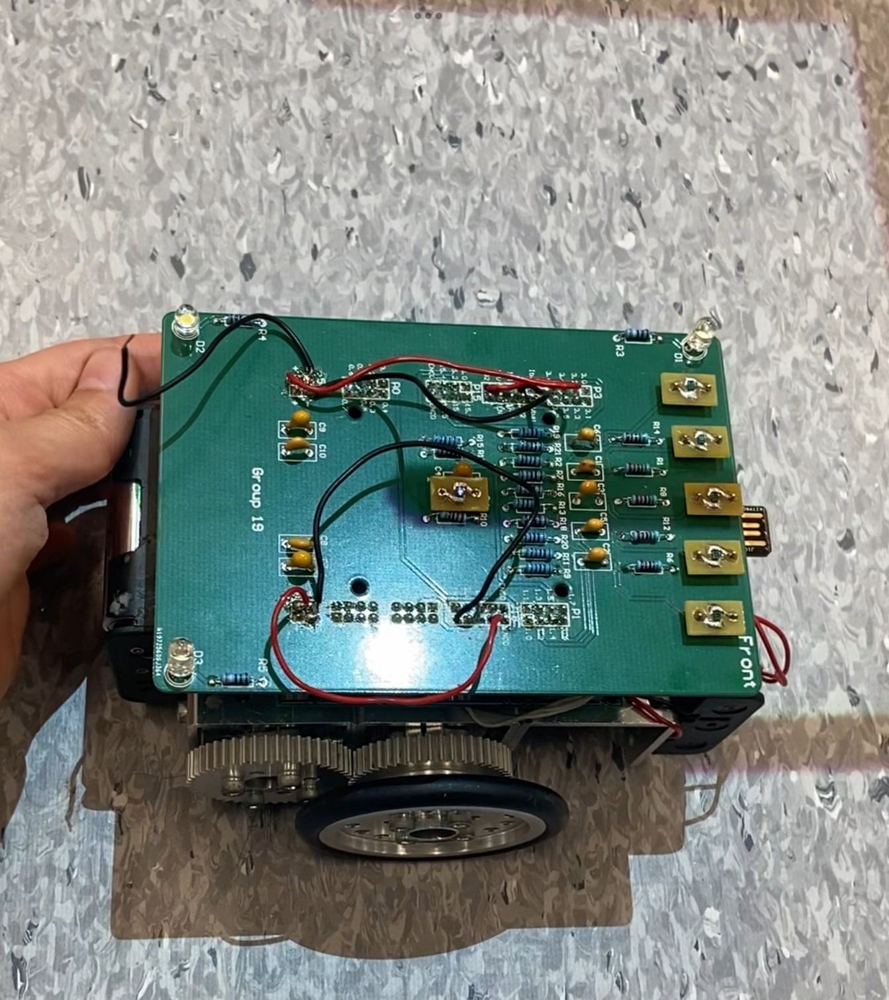
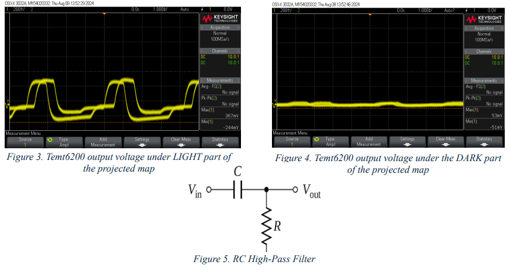
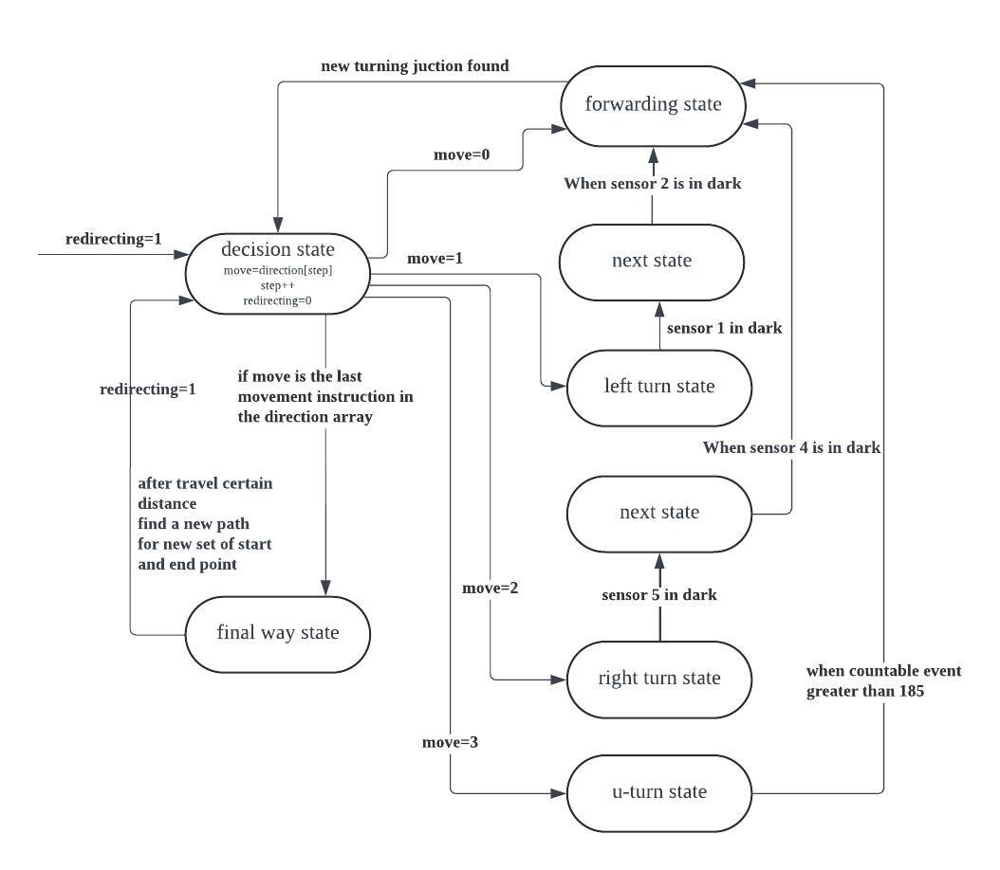
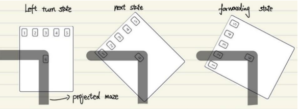

# Autonomous Line-Following Robot – PSoC Embedded System

## Overview

This project is a hardware-software co-design project built around a Cypress PSoC embedded platform. The objective was to develop a two-wheeled autonomous robot capable of navigating a projected maze, following paths, detecting junctions, and collecting target points in a predefined order.

The system combines phototransistor sensors, analogue signal conditioning, ADC-based sensing, finite state machine (FSM) control, and motor actuation to produce autonomous behaviour on real hardware.

This repository serves as a portfolio case study focusing on my contributions to:

* ADC sensor reading
* Signal filtering
* FSM-based turning logic
* Hardware-software integration
* Embedded system testing and debugging

---

# Demo

## Robot Walking Demo

  

---

# Hardware Platform

## Robot Overview

  

The robot platform consists of:

* Cypress PSoC development board
* Two DC motors
* Differential drive chassis
* Six phototransistor sensors
* Custom sensor circuitry
* Embedded control software

---

# Sensor System

## Sensor Layout

  

Six phototransistor sensors were used for path detection.

Sensor responsibilities:

| Sensor | Purpose                               |
| ------ | ------------------------------------- |
| 1–5    | Line following and junction detection |
| 6      | Turn completion detection             |

Sensor values were sampled through the PSoC ADC and processed using threshold-based detection logic.

---

## Sensor Processing

Ambient lighting introduced significant noise into the phototransistor signals.

To improve reliability:

* Analogue high-pass filtering was implemented.
* Sensor thresholds were experimentally calibrated.
* ADC readings were analysed under different operating conditions.

### Sensor Reading Analysis

  

This testing process was used to determine reliable detection thresholds for line tracking and junction identification.

---

# Navigation Logic

## FSM-Based Turning Control

The robot's movement controller was implemented as a finite state machine.

Main states included:

* Decision State
* Forward State
* Left Turn
* Right Turn
* U-Turn
* Final State

The FSM determines movement behaviour using sensor input and path instructions.

### Turning FSM

  

---

## Turn Completion Logic

One challenge encountered during development was reducing turn overshoot.

The following diagram illustrates how sensor placement was used to determine when the robot had successfully completed a turn and could transition back to the forwarding state.

By combining sensor readings with FSM state transitions, the robot could:

* Detect junctions
* Execute turns
* Reacquire the path
* Resume normal line following

This significantly improved navigation accuracy.

---

# My Contributions

My primary responsibilities included:

* Designing FSM-based turning logic
* Implementing ADC sensor reading
* Developing threshold-based line detection
* Contributing to analogue filter design
* Integrating sensor input with movement decisions
* Testing and refining turning behaviour to reduce overshooting

I worked closely with teammates responsible for pathfinding, PCB design, soldering, and motor control integration.

---

# Testing and Debugging

Development involved extensive testing on physical hardware.

Key challenges included:

* Ambient lighting interference
* Sensor calibration
* Turn overshoot
* Junction detection reliability
* Sensor-to-motor response timing

Multiple iterations of testing and refinement were required before stable navigation behaviour was achieved.

---

# Firmware Engineering Relevance

This project demonstrates several firmware and embedded systems concepts:

* ADC-based sensor acquisition
* Real-time control logic
* Finite state machine design
* Hardware-software integration
* Signal conditioning
* Embedded debugging
* Physical system testing

The project strengthened my understanding of how sensor inputs, control logic, and actuators interact within a real embedded system.

---

# Future Improvements

Potential future work includes:

* PID-based path correction
* Sensor auto-calibration
* Telemetry logging for debugging
* More advanced path planning
* Improved modularisation of control logic
